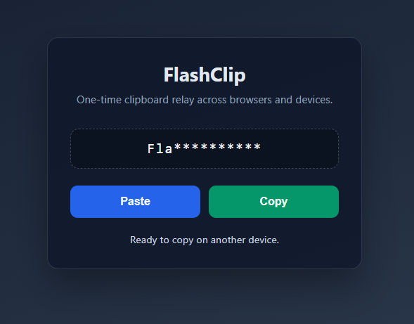

# FlashClip



FlashClip is a one-time clipboard relay for browsers and devices. Paste text on one machine, then copy it on another. Nothing is written to disk.

Repo: https://github.com/LoganRickert/flash-clip

## Quick start

Pull and run the published image:

```bash
docker pull ghcr.io/loganrickert/flash-clip:latest
docker run --rm -p 4089:3000 ghcr.io/loganrickert/flash-clip:latest
```

Open http://localhost:4089

Or build and run locally:

```bash
./build.sh
./run.sh
```

Open http://localhost:4089

`run.sh` removes any existing `flash-clip` container and starts a fresh one on port 4089 with `--restart unless-stopped`.

To run in the foreground on port 3000 instead:

```bash
./build.sh
docker run --rm -p 3000:3000 flash-clip
```

Open http://localhost:3000

Run the Docker smoke tests:

```bash
./test.sh
```

## How it works

1. **Paste**: reads your clipboard and sends the text to the server. The string is stored encrypted in memory.
2. **Preview**: the page shows the first 3 characters followed by 10 asterisks, for example `use**********`.
3. **Copy**: fetches the full string, writes it to your clipboard, and deletes it from the server.

Each paste can only be copied once. If the server or container stops, anything waiting to be copied is lost.

Paste size is limited to **2 MB**.

Open FlashClip in multiple browsers or tabs at the same time. When someone pastes, every connected page gets a live alert and updated preview over WebSockets.

### Keyboard shortcuts

Click the page to focus it, then use:

| Shortcut | Action |
| -------- | ------ |
| Ctrl+V / Cmd+V | Paste from your clipboard to the server |
| Ctrl+C / Cmd+C | Copy from the server to your clipboard |

These match the Paste and Copy buttons.

## Local development

Install dependencies:

```bash
pnpm install
```

Start the backend:

```bash
pnpm dev:server
```

In a second terminal, start the frontend:

```bash
pnpm dev:client
```

The Vite dev server proxies `/api` and WebSocket requests to the backend on port 3000.

Build the client for production:

```bash
pnpm build
```

## Project layout

```text
client/    React frontend (Vite)
server/    Fastify API, WebSockets, and static file serving
build.sh   Builds the Docker image as flash-clip:latest
run.sh     Recreates the Docker container on port 4089
test.sh    Builds the image and runs API smoke tests in throwaway Docker
```

## API

| Method | Path | Description |
| ------ | ---- | ----------- |
| POST | `/api/paste` | Store clipboard text. Body: `{ "text": "..." }`. Max 2 MB. Returns 413 if too large. |
| GET | `/api/preview` | Return the masked preview if text is stored |
| POST | `/api/copy` | Return the full text once, then delete it |
| WS | `/api/ws` | Live preview updates when text is pasted or copied |

WebSocket messages use JSON, for example:

```json
{ "type": "preview", "event": "pasted", "preview": "use**********", "hasContent": true }
```

## CI

GitHub Actions runs on push and pull requests. It builds the client, builds the Docker image, and runs a smoke test against the API.

On push to `main`, CI also publishes the Docker image to GitHub Container Registry as `ghcr.io/loganrickert/flash-clip:latest`. The first time, you may need to set the package visibility to public under GitHub Packages settings.

## License

MIT. See [LICENSE.md](LICENSE.md).
